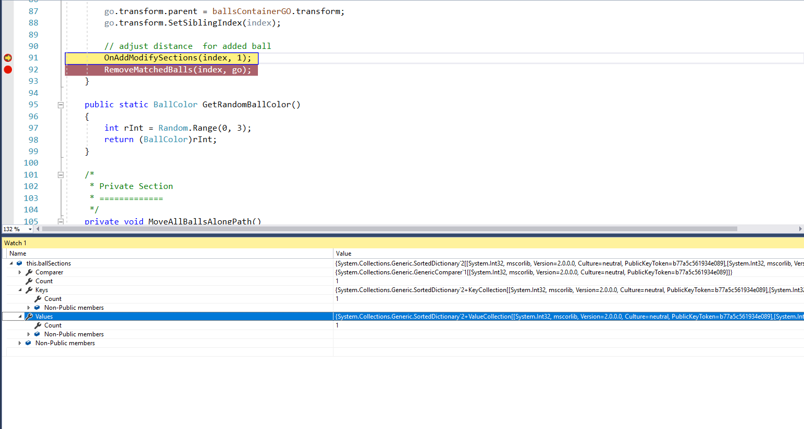
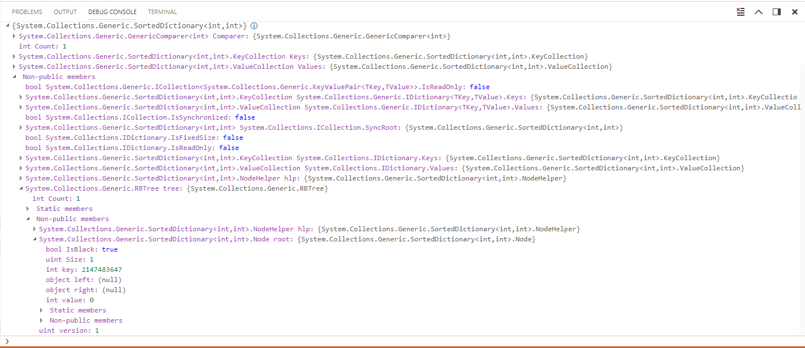

## Intro

Recently when I was working on a Unity3D project I came across a scenario where I had to use SortedDictionary. Debugging the values contained in that container was important to implement a usecase in my app. But to my surprise the values were not available in the debugger readily. What I mean by this is that unlike Dictionary, for which contents were showed in debugger, its contents were not displayed readily at the root when expanded as shown in the pic below.



## So where are the values then?

The contents of the SortedDictionary were actually available but were inside a nested key called tree. Yes a tree since SortedDictinoary is internally implented as a tree.

```
<Your Vairable> -> [Non-public members]tree -> [Non-public members] root
```

Checkout the below picture for better understanding. Although the info is not availble in a sorted list, its useful enough to check the values. In my usecase there were very few keys and didnt even need a `sortedDictionary` now that i think.

Here one can check the values by traversing further the tree by expanding the `object left` or `object right` keys.


